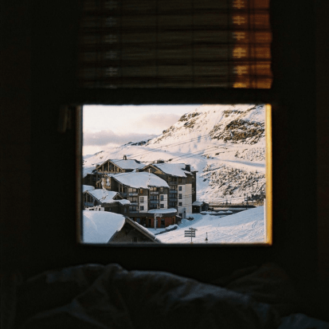
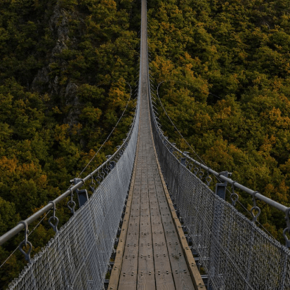

# Spots

## Description

An image sharing site

## Technologies and Tools Employed

- HTML
- CSS
- Responsive Design
- GitHub
- Figma

**GitHub**

- [Deployment Link](https://oliverpm21.github.io/se_project_spots/)

**Images**

